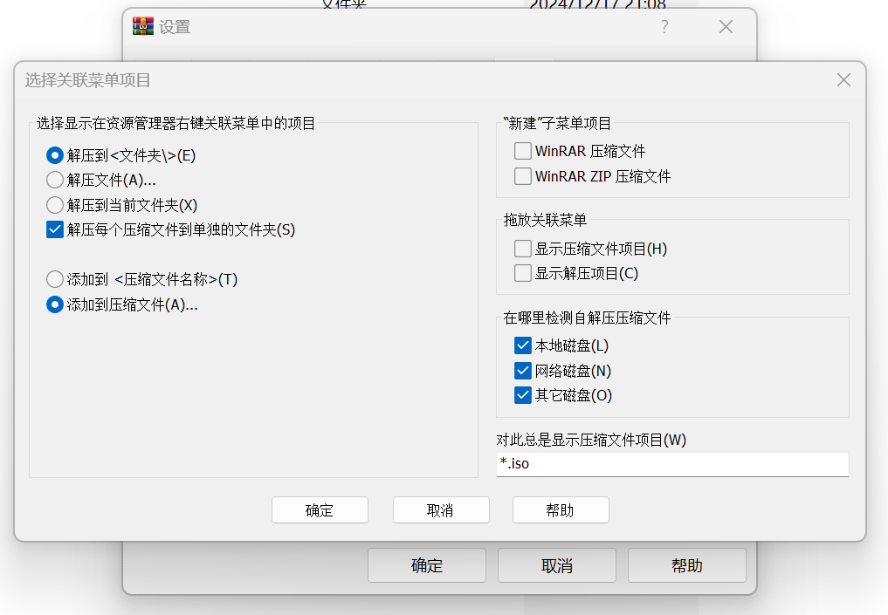
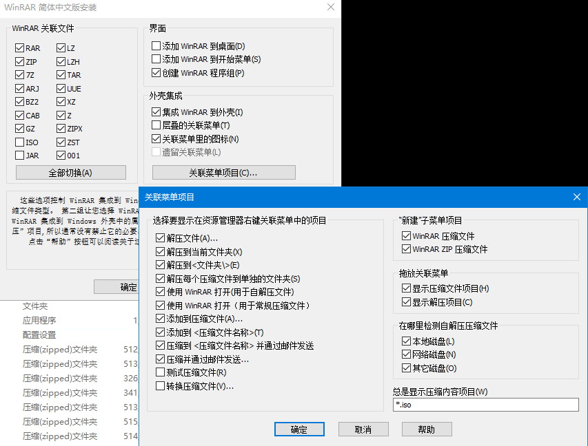

{: .shadow }
_Win11下，WinRAR的“选择关联菜单项目”设置界面_

装了Win11之后一直没想明白为啥左边的功能（eg.“解压到XX文件夹”“解压文件……”“解压到当前文件夹”）只能单选

刚才给Win10装WinRAR，进去设置的时候发现是可以多选的↓

{: .shadow }
_Win10下，WinRAR的“选择关联菜单项目”设置界面_

然后就联想到是“层叠的关联菜单”这一项有影响，简单实验得出结论：

Win11只能允许单个应用创建一个右键菜单项，除非启用二级菜单（即“层叠的关联菜单”）  
Win10没有这个限制，开不开二级菜单都能多选
