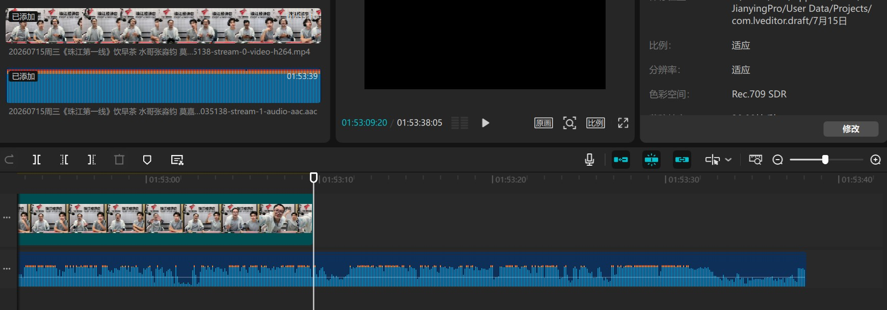
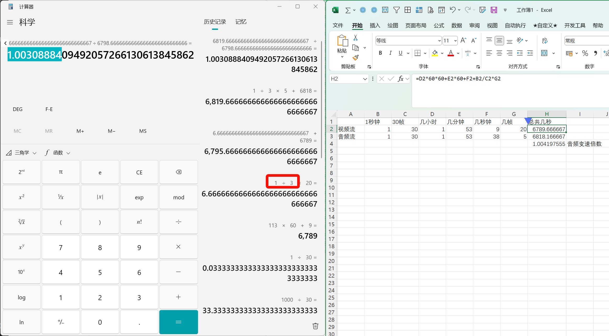

之前直接在平台上看，看着看着就音画不同步。下载下来本地播放试试，还是这个鸟样。

一开始直接把MP4丢进剪映，分离音频，一点点调音频倍速，试出来，声音少了十几秒。

拿着这样分析出来画面时长和声音时长，计算好倍速用ffmpeg修复，结果出来的MP4还是对不上。

后来用LosslessCut把画面轨道和声音轨道（视频流和音频流）分别提取出来丢进剪映，才发现画面和音频都没少，但是似乎视频帧率跟音频帧率设置有问题，音频时长>视频时长。

{: .shadow }

于是意识到刚才直接把原视频丢进剪映，它直接把没有画面的最后一段声音丢掉了（当然也可能是剪映不够专业）

接着拿着新数据哐哐算半天，最后ffmpeg出来的还是不对，定眼一看，算错数了，要重算一遍有点崩溃，然后想起来有个东西叫Excel🤣

{: .shadow }

最后是成功了。计算依据就是LosslessCut提取的两条轨道在剪辑软件里显示的时长。