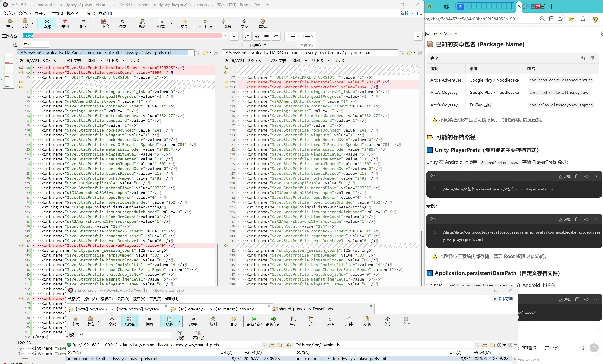
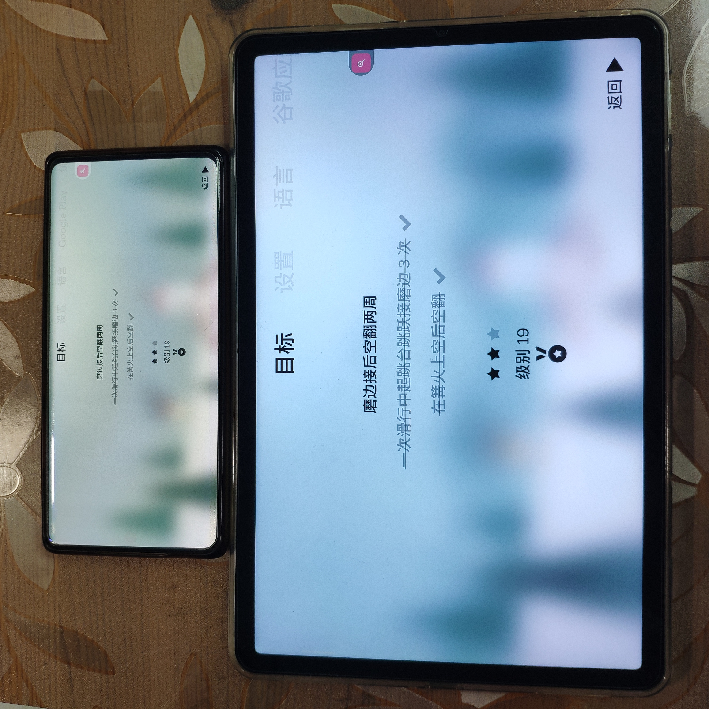

用Unity做的游戏在Android平台上的默认存档路径是  
`/data/data/<包名>/shared_prefs/<包名>.v2.playerprefs.xml`{: .filepath}

比如阿尔托的冒险Alto's Adventure国际服（还是叫官服？相对于TapTap国服）就是  
`/data/data/com.noodlecake.altosadventure/shared_prefs/com.noodlecake.altosadventure.v2.playerprefs.xml`{: .filepath}

比如阿尔托的奥德赛Alto's Odyssey国际服（官服）就是  
`/data/data/com.noodlecake.odyssey/shared_prefs/com.noodlecake.odyssey.v2.playerprefs.xml`{: .filepath}

另外，本次存档迁移探索中，来源是第shan三zhai方重新包装（包名不是官服也不是TapTap国服，弹广告、霸道索要定位权限）的低版本，目标是官服的最新版。

{: .shadow}

