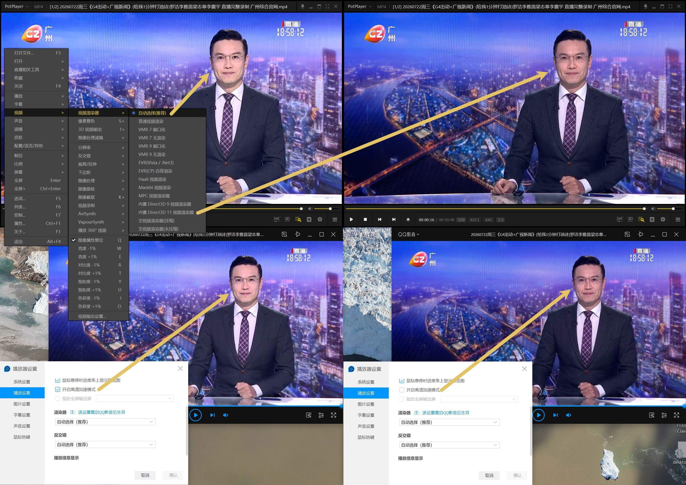
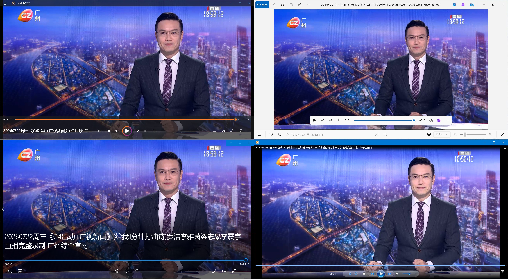

之前觉得家里的台式机播视频怪怪的，偏亮偏白略微过曝，以为是远程软件的问题，这两天直接用也是这样子，一番查找：

[Potplayer 怎么调整画质？颜色不正常，有色差，画面发白 - 知乎](https://zhuanlan.zhihu.com/p/639786672)

>原因：Potplayer 默认自动选择视频渲染器，导致画质奇差，画面发白，模糊不清。  
>**方法：右键 - 视频 - 视频渲染器 - 把 自动选择(推荐) 改成: 内置Direct3D 11 视频渲染器**

以此类推，发现QQ影音修改渲染器没有效果，注意到有个“高清加速模式”的开关……👀……🤔……👉……果然是

{: .shadow}

另，Win11自带播放器四件套测试如下（24H2）

{: .shadow}
_（从左到右 从上到下）媒体播放器 照片 电影和电视 旧版WindowsMediaPlayer_