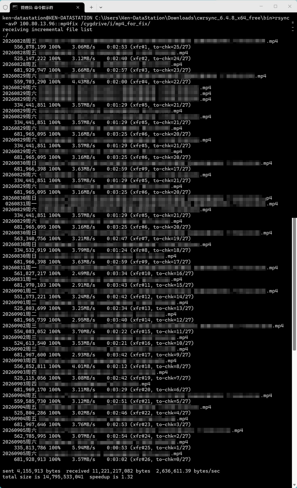
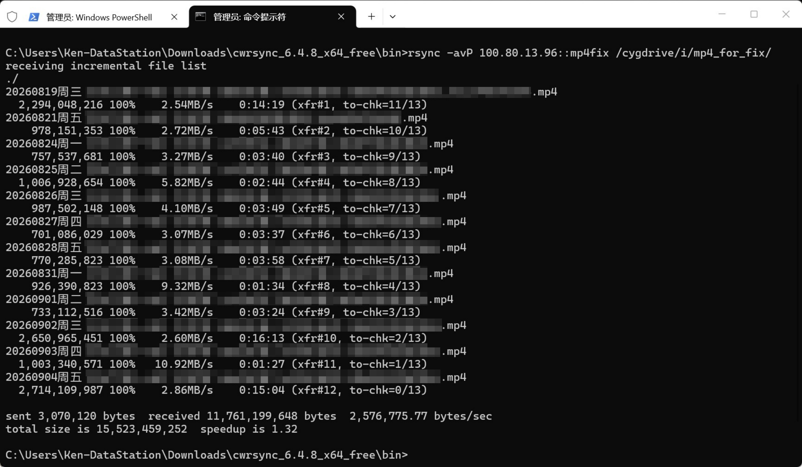
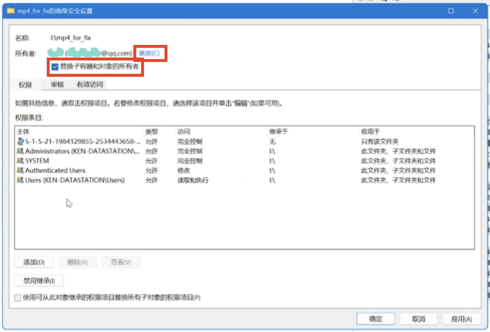

## 背景

把笔电上一堆视频文件通过Windows自带的SMB共享复制到另一台电脑上。之后做了个哈希校验，结果只有一两个是一致的，十分甚至九分的惊讶，一边感叹养成了顺手校验的好习惯，一边反思为啥装了FastCopy不用，一边开始漫长的修复。

因为两台电脑分隔两地了，而其中一边带宽感人，不想重新完整复制一次。想到“二分查找”的方法，就思考能不能对文件做二分校验，两台电脑只交换文件或文件切片的哈希值，直到定位到并传输差异部分。

咨询了下AI，如果单纯是位反转，这么做没问题；如果是多了或少了，而二分校验的起终点不会跟着变化，那么校验下来会觉得后面的部分都是错的（也就是同一个部分在两边的文件里的位置不一样了）。

可以简单理解为两条同样的队伍，其中一边有人插队/走了，那么原本并排的两个人就错开了，而算法只会机械地看两条队的第1个是不是天生一对、第二个是不是天生一对……

AI的意见是不如站在巨人的肩膀上，用cwRsync，说它做了“滑动窗口”逻辑，解决上述因为插入/缺失导致后面部分在文件内的偏移量不同导致难以校验的问题。

于是有了以下**由AI指导的**修复过程。

## 安装

（可能是）官网：[https://itefix.net/cwrsync](https://itefix.net/cwrsync)

目前新版（或者说近几个版本）的客户端（Client）是免费的，但服务端（Server）收费。不过，据AI说
> cwRsync Server 4.1.0 是 itefix 发布的最后一个免费服务端版本

那么我们可以在网上找旧版本。我用的是[Github@denis-zheng分享的4.0.5版本](https://github.com/dennis-zheng/cwRsync)。

> 注意，像本文这种只用来修复文件的场景，不需要按照他给的`readme.docx`来安装。
{: .prompt-tip }

客户端我用的是官网下的6.4.8版本。

### 在文件原件的电脑上安装服务端（Server）

从上述Github链接下载`cwRsyncServer_4.0.5_Installe.zip`并解压、安装

安装目录改不改都行，**路径不要带中文**。账号密码就填你电脑登录的账号密码，或者填一个你能记住的也行，反正只修复文件的话这个账号密码也用不上。`readme.docx`里提到的替换`rsyncd.conf`和更改服务启动模式都不用管。

### 在文件副本的电脑上安装客户端（Client）

6.4.8版本的客户端直接解压后就能用了，不需要安装的，**也是路径不要带中文**。

## 配置

把需要用到的原件抽出来放到一个文件夹，建议这个文件夹放根目录下且文件夹名全英文无空格无符号。  
副本文件同理。

在原件电脑（服务端）的安装目录（默认是`C:\Program Files (x86)\ICW\`）找到`rsyncd.conf`，参考以下示例修改：  
（示例由AI指导，我自己用着没察觉问题，不包好doge）  
> 请删除以下配置文件中所有中文，包括注释中的中文提示，以避免不必要的麻烦
{: .prompt-warning }

```ini
use chroot = false
strict modes = false
hosts allow = *
log file = rsyncd.log
pid file = rsyncd.pid 
port = 873
uid = 0
gid = 0
max connections = 5


# Module definitions
# Remember cygwin naming conventions : c:\work becomes /cygwin/c/work
#

# 下面这个方括号里填啥都行，但建议简短无空格无符号小写英文，以避免不必要的麻烦，因为后面操作要用
[mp4fix]
path = /cygdrive/<小写盘符>/<原件所在具体路径，如上两行注释所述，请注意使用斜杠而非反斜杠>
# FYI. path = /cygdrive/d/mp4_for_test
read only = yes
transfer logging = yes
lock file = no
```

## 开始修复

### 原件电脑

打开一个管理员CMD

然后运行：（记得改为你的实际路径）
```bat
"C:\Program Files (x86)\ICW\Bin\rsync.exe" --daemon --no-detach --config="C:\Program Files (x86)\ICW\rsyncd.conf"
```

### 副本电脑

在解压后的文件夹里找到`rsync.exe`所在目录，在这里打开管理员CMD（或者先打开管理员CMD然后cd到这里）

然后运行：
```bat
rsync -avP <原件电脑IP>::<配置文件方括号里的名称> /cygdrive/<副本视频所在的盘符（小写）>/<副本文件夹的具体目录>
```

> 命令参数解释 by [背字根](https://www.beizigen.com/post/cwrsync-on-windows/)
> - -a：归档模式（最常用），等价于 -rlptgoD，包含：递归、保留链接、权限、时间戳、属主、属组、设备 / 特殊文件，适合完整备份；
> - -v：显示同步详情，如同步的文件、进度、大小；
> - -P：断点续传 + 显示进度，推荐开启；
> 
> Rsync其他参数（来源同上）
> - -r：递归目录，-a已经包含；
> - -q：静默模式，只显示错误信息；
> - -n：模拟测试，不实际同步。在执行会删除文件的操作前可以先模拟同步测试；
> - -z：传输时压缩数据，远程同步时推荐开启，本地同步开启会变慢；
> - –progress：显示实时传输进度，如文件已传百分比、速度、剩余时间；
> - –delete：删除目标端有但源端没有的文件 / 目录，实现目标端和源端完全一致；
> - -e：指定远程Shell，例如：-e “ssh -p 2222 root@ip”；
> - –remove-source-files：同步完成后删除源文件，只保留目标端文件，慎用！
{: .prompt-tip }

{: .shadow }
_终端输出1_
{: .shadow }
_终端输出2_

对于终端输出的信息，AI这么解释：
> 进度摘要信息：
> - **`xfr#1`**：这是第 **1** 个实际被**传输**的文件（xfr = transfer）。只有内容有差异、需要传输数据的文件才会被计入这个编号
> - **`to-chk=11/13`**：还有 **11** 个文件待检查，总共 **13** 个文件
> 
> 跑完后看最后的汇总行：
> - **`sent`**：副本端发出去的数据量（主要是校验和，很小）
> - **`received`**：副本端收到的数据量（差异块，这是实际修复传输的量）
> - **`speedup`**：增量同步相比全量传输的加速倍数，数值越大说明差异越小、省的时间越多

## 修正文件权限

跑完上面的命令之后会发现，副本文件夹打不开。

解决办法：

首先，原件电脑上正在运行的那个管理员CMD，按`Ctrl+C`停止Rsync Server。

然后，副本电脑上选中副本文件的文件夹，进入`高级安全`  
（以Win10文件资源管理为例，`高级安全`在顶部功能区的`共享`选项卡），  
更改`所有者`为副本电脑正在登录的账号（如果不知道，可以在“系统设置-账户”里看），  
记得勾选`替换子容器和对象的所有者`复选框
{: .shadow}
_更改副本文件夹所有者_
> 可以顺手把S开头那个用户也删掉，那个应该是原件电脑的账户
{: .prompt-tip }

接着，副本电脑上管理员CMD逐条运行：
```bat
takeown /f "D:\副本端MP4文件夹路径" /r /d y
icacls "D:\副本端MP4文件夹路径" /reset /t /c /q
icacls "D:\副本端MP4文件夹路径" /grant %USERNAME%:F /t /c /q
```
例如
```bat
takeown /f "I:\mp4_for_fix" /r /d y
icacls "I:\mp4_for_fix" /reset /t /c /q
icacls "I:\mp4_for_fix" /grant %USERNAME%:F /t /c /q
```
AI对上述命令参数解释如下
> takeown命令参数：
> - **`/f`**：指定目标文件或文件夹路径
> - **`/r`**：递归处理，包括所有子文件夹和子文件
> - **`/d y`**：当当前用户对某个文件夹没有"列出内容"权限时，系统会弹出确认提示问你是否继续，`y` 表示自动回答"是"，不用手动一个个确认
> 
> icacls命令参数：
> - **`/grant %USERNAME%:F`**：给当前登录用户授予完全控制权限（`F` = Full Control）。`%USERNAME%` 是系统变量，会自动替换成你当前的用户名
> - **`/t`**：递归处理所有子文件夹和子文件
> - **`/c`**：遇到权限错误时继续处理剩余文件，不中断。因为有些文件可能被系统锁定，没这个参数的话碰到一个错误就停了
> - **`/q`**：静默模式，不逐个显示每个文件的处理结果，只在最后显示汇总。不加的话屏幕上会刷一大堆文件名，很影响阅读


> Example line for prompt-tip.
{: .prompt-tip }

> Example line for prompt-info.
{: .prompt-info }

> Example line for prompt-warning.
{: .prompt-warning }

> Example line for prompt-danger.
{: .prompt-danger }